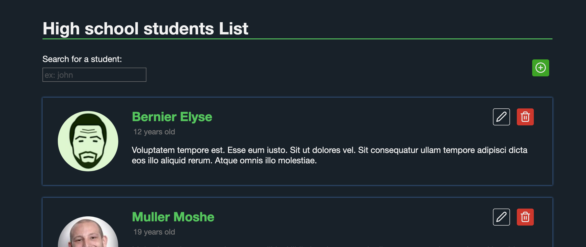
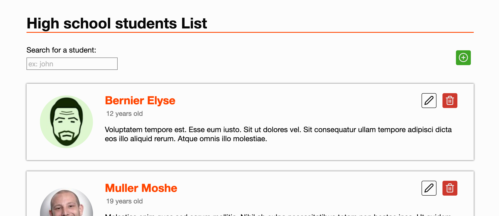

# Frontend

## Architecture

### State container

L'état de l'interface est pris en charge par [smart-table](https://smart-table.org), une librairie que j'avais écrite et qui permet de créer des listes intelligentes qu'on peut trier, chercher, etc indépendamment de la couche de rendu.
Elle fonctionne un peu comme un store REDUX et est adaptée pour ce genre de projets. On peut aussi l'augmenter sans que les composants soient impactés: ici avec des fonctions CRUD, un faux service, la gestion des modales.

J'avais fait une adaptation pour react il y a quelque temps et c’était aussi l'occasion de me remettre a jour sur React (que je n'ai pas utilisé depuis plus d'un an..) et d'utiliser les hooks.

### Service

Il y a un faux sdk qui simule les appels réseau, et les extensions pour smart table

### hooks

Rien de sophistiqué: simples souscriptions pour mettre a jour l'interface en fonction de l’état de smart table. Les hooks gagneraient a être optimisés en gérant les "dépendances" mais ils font le boulot pour l'instant

### Composants et UI

Pas de choses particulières. La search box est "debouncee" pour éviter les appels réseau a répétition. Il y a une pagination en bas et les interactions se font via une modale.
Une combinaison de variables css et de media queries permettent de rendre le thème fluide et de s'adapter aussi aux préférences du système d'exploitation:

Il y a quelques problèmes d’accessibilité a régler notamment sur les phases transitoires (quand la liste est rafraichie) et sur la modale qui ne piège pas la navigation clavier.

### Test et CI

J'ai rajouté quelques tests juste pour montrer l'organisation. J'ai fait des essais avec une librairie que j'avais écrite pour faire tourner les tests dans un vrai navigateur plutôt que JSDOM. En vrai je crois que j'utiliserais l'outillage made in Facebook mais c'était histoire de voir une différente approche. 

Sur la plateforme de CI les tests tournent dans chromium via puppeteer. En cas de succès, l'application est [deployée](https://lorenzofox3.github.io/lls-test/) (gh-pages ici) en utilisant les actions github
