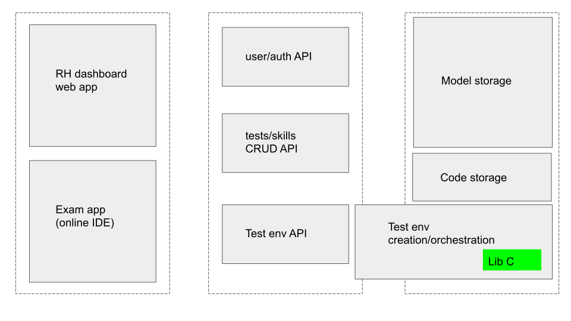
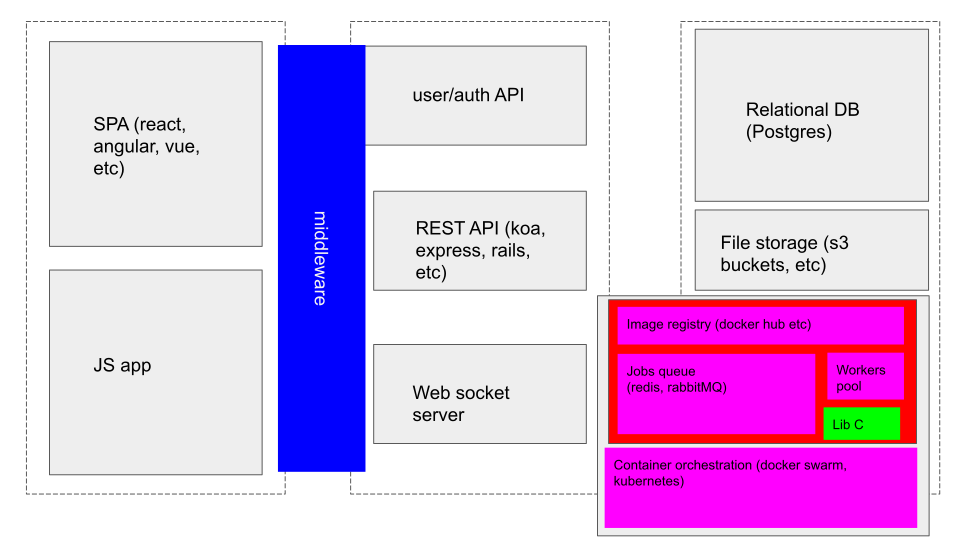

## Vue d'ensemble

L'expérience des différents utilisateurs au sein de la plateforme peut s'exprimer en trois temps distincts:

1. Planification d'un test par un RH
2. Exécution d'un test par un candidat lors d'une session
3. Analyse des résultats par RH

Pour réaliser cette expérience nous devons couvrir les zones fonctionnelles suivantes:

* gestion des utilisateurs et de leurs droits d'accès avec éventuellement leurs sessions, au sens large
* gestion des compétences et plans de test nécessaires à la création d'un environnement de test et de l'analyse d'une session de test
* gestion d'une session de test (au moment du test) et de l'interaction avec environnement de test

## Entités en présence

Sans présumer de la solution de stockage, on pourrait modéliser les structures de données avec un schéma apparenté à l'ensemble des "tables" suivantes

### Utilisateur/Authentification/Authorisation

Les **utilisateurs** appartiennent à un **rôle** qui leur donne un certain nombre de privilèges. Un rôle possède éventuellement plusieurs utilisateurs. Les entités sont normalisées de telle sorte qu'un rôle peut voir ses privilèges évoluer et les changements appliqués à tous ses membres

#### utilisateurs

|user_id| email | nom | ...etc | role_id|
|:------|:-----:|:---:|:------:|-------:|
|1234   | foo@example.com | Bob | ... | 789|
| ...|

#### roles

| role_id | title | permissions |
|:--------|:-----:|------------:|
| 789 | RH | {test:'read'} |
| ...|

Les permissions étant peu spécifiées on peut considérer un champs semi structuré et dynamique type JSONB

#### sessions

Selon la stratégie de session retenue, on pourra rajouter les entités nécessaires.

### plans de test

Un certain nombre de **compétences** forment un **plan de test** défini par un **utilisateur** (avec le rôle RH dans notre cas)

#### compétences

| skill_id | title | description | code_flag |
|:---------|:-----:|:-----------:|----------:|
| 1234 | web | "checks whether a applicant masters web development" | 598 |
|...|

Le ``code_flag`` peut être vu comme une instruction à l'algorithme qui génère un programme/environnement de tests (dans notre cas la librairie C) et peut être raffiné ou complexifié selon les spécifications

#### tests

| test_id | title | description | ... | env |artifact_id| user_id |
|:--------|:-----:|:-----------:|:---:|:---:|:---------:|--------:|
|  1234   | "react expert" | "will go through a complex react application ..." |...| BROWSER_REACT | 239 | 1234 |

On notera que le champs ``env`` gagnerait à être normalisé via un schéma d'entités plus approfondi. L'idée étant de définir un ensemble d'instructions nécessaires à la création d'un environnement relatif au test. 
De même, on gardera la notion **d'artefact** abstraite pour l'instant. Mais on peut imaginer le nom d'une image docker, l'adresse d'un script pour lancer un environnement, l'adresse d'un répertoire git contenant ce qui est nécessaire à démarrer un environnement, etc

Un test appartient à un **propriétaire** (un RH) et un utilisateur peut être le propriétaire de plusieurs tests.

Finalement un test est relié à un ensemble de **compétences**. Une compétence peut elle-même intervenir dans plusieurs tests. Les deux entités pouvant être liées via une "entité pivot" (relation many-to-many)

#### test session

Une session de test est ce qui lie un **candidat** à un **plan de test** via notamment le code qu'il aura écrit au cours de sa session

| session_id | user_id | test_id | date | span | code |
|:-----------|:-------:|:-------:|:----:|:----:|-----:|
|1234 | 784 | 234 | 24/02/2022 14:32| 3h | git@my-app.com:user/repo.git |

une session de test complète la relation *many-to-many* entre un **test** et un **candidat**

On notera qu'elle contient les informations relatives a la durée et la planification ainsi qu'un lien (au sens large) vers la solution de stockage du code présenté par le candidat (ici un répertoire git)

## Architecture

Le schéma ci dessous définit une vue d'ensemble des différentes parties à articuler ensemble.

### Stockage

Les entités métiers peuvent être stockées via différentes solutions sans contraintes particulières. Une solution via une base de donnée relationnelle semble un bon choix par défaut de par la nature des données et la polyvalence de ces systèmes (Postgres). 

On notera en revanche les cas particuliers:
* l'artefact pour créer l'environnement de test, possiblement une image docker stockée dans un registre centralisé ou interne à l'entreprise.
* le code du candidat peut être stocké directement dans la base de données mais gagnerait possiblement a être stockée via une solution spécialisée tel qu'un système de contrôle de versions comme git ou comme une archive sur système de fichier (type NAS ou via un service cloud)
* les données relatives à une session, selon la solution retenue peuvent être stockées dans une base clef/valeur de type Redis

### API métier

#### Entités avec peu d'écritures

L'API présente relativement peu de contraintes que se soit en terme de charge ou temps de réponse. Il y aura l'exception des terminaisons qui permettent la communication entre un candidat et son environnement de test ainsi que son espace de stockage: 
beaucoup d'accès I/O en un temps limité, que se soit pour obtenir le retour de l'environnement ou que se soit pour sauvegarder le code du candidat lors d'une session.

La partie plus stable de l'API peut donc se présenter sous la forme d'un service monolithique. On pourra aussi segmenter via différents services non pas pour des problèmes de charge mais d'organisation humaine. Exemple:
* service user/auth
* service préparation de test/ gestion des environnements

Ou même une solution "serverless" si l’équipe maîtrise les technologies cloud et/ou est déjà "liée" a un fournisseur particulier. 

La technologie choisie ici est finalement peu importante. 

On notera tout de même que lorsque un plan de test est crée ou modifié, quelque soit la solution retenue pour l'environnement de test, ce sera fort probablement un process relativement long. Ainsi la terminaison de l'API relative aura simplement pour effet de dire au RH que la demande est prise en compte et 
planifiera sous forme de job dans une queue la tâche plus longue pour ne pas pénaliser le/les serveurs de l'API.

#### Entités relatives à une session de test

Lors de sa session de test le candidat s'attend à pouvoir tester son code et avoir un retour. Pour cela, on peut envisager une solution qui maintient une connexion bidirectionnelle permanente, type web socket qui peut facilement rediriger les flux standards de l'environnement de test vers l'IDE en ligne.
Étant donné la charge attendue il sera dans ce cas important de dimensionner le nombre de serveurs et leur puissance en fonction de cette contrainte. A noter tout de même que ces serveurs ne seront rien de plus que des passerelles de communication qui peuvent atteindre naturellement une concurrence élevée de part l'architecture de l' *event loop*

Alternativement on peut tolérer un léger décalage dans le temps et bâtir cette API de manière traditionnelle (REST) sollicitée uniquement par l'application client (quand le candidat décide d'exécuter son code)

### Environnement de test (backend)

De part la diversité des langages, leurs natures (compilé ou interprété) et éventuellement un grand nombre de combinaisons de compétences à tester, on peu s'attendre à ce que la création d'un test coïncide avec la création d'une image pour container (style image docker).  
Cela répondrait aussi à la contrainte de *scalabilité* évoquée dans l'énoncé: les containers donne une scalabilité horizontale théoriquement infinie et pourraient être démarrés selon la demande. 
On peut construire les programmes de tests de telle façon que le résultat soit sous la forme d'un flux textuel pour pouvoir le combiner à d'autre process ou le rediriger plus facilement. La variable d'entrée serait dans ce cas le code du candidat.

Alternativement on peut déléguer cette tâche à un service tiers spécialisé. Un rapide tour sur DuckDuckGo nous renseigne [jdoodle](https://jdoodle.com), [repl.it](https://repl.it), etc

### Sessions

La gestion des sessions au sens large ou de test peut se faire de manière *stateless* via par exemple des tokens qui portent toute l'information (type JSON web tokens). L'avantage est que la couche de middleware peut être partagée. On notera que dans ce cas les différents composants doivent partager la configuration, notamment le secret utilisé pour signer/décoder les tokens ... 
Il faut aussi dans ce cas imaginer que les permissions octroyées à un rôle ne change pas durant la durée de validité d'un token...

On peut aussi choisir de centraliser la gestion des sessions au service d'auth. qui devra exposer une terminaison d'inspection de tokens aux autres services. L'avantage est que la solution technique utilisée n'a pas besoin d'être transparente (JSON web token, redis, RDBS, etc) aux autres services. En revanche c'est un 'single point of failure' évident.

### Dashboard RH

Pas de contraintes particulières ici (pas SEO, performances correctes mais pas critiques, etc): une *single page app* avec le framework favoris de l'équipe fera l'affaire.

### IDE en ligne

Pas besoin de framework, on peut découper les différentes parties de l'écran comme des mini app isolées. En revanche, pour éviter les couplages, il sera peut être utile de centraliser l'état de l'interface graphique et les données chargées avec une solution de type REDUX.

### Exemple d'architecture

La figure ci dessous représente une architecture théorique qui à mon sens remplit les conditions et contraintes

